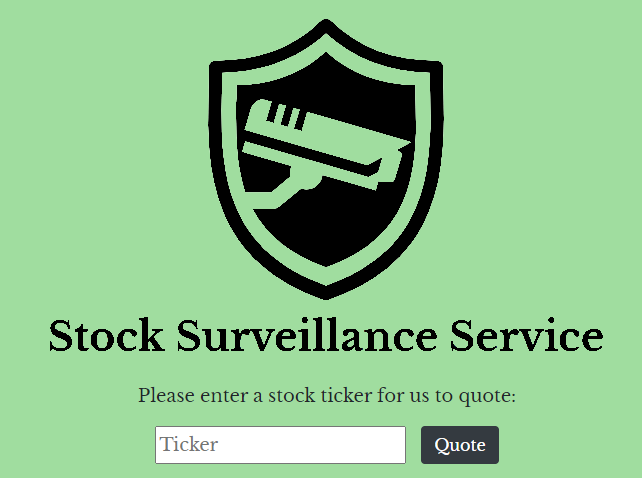

# Stock Surveillance Service

A project developed by Austin Webber and Tony Petersen as a multi-tier web application for CSIS 630 at UWRF.

Customers will be able to screen stocks, create a stock watchlist, and setup stock notifications.
